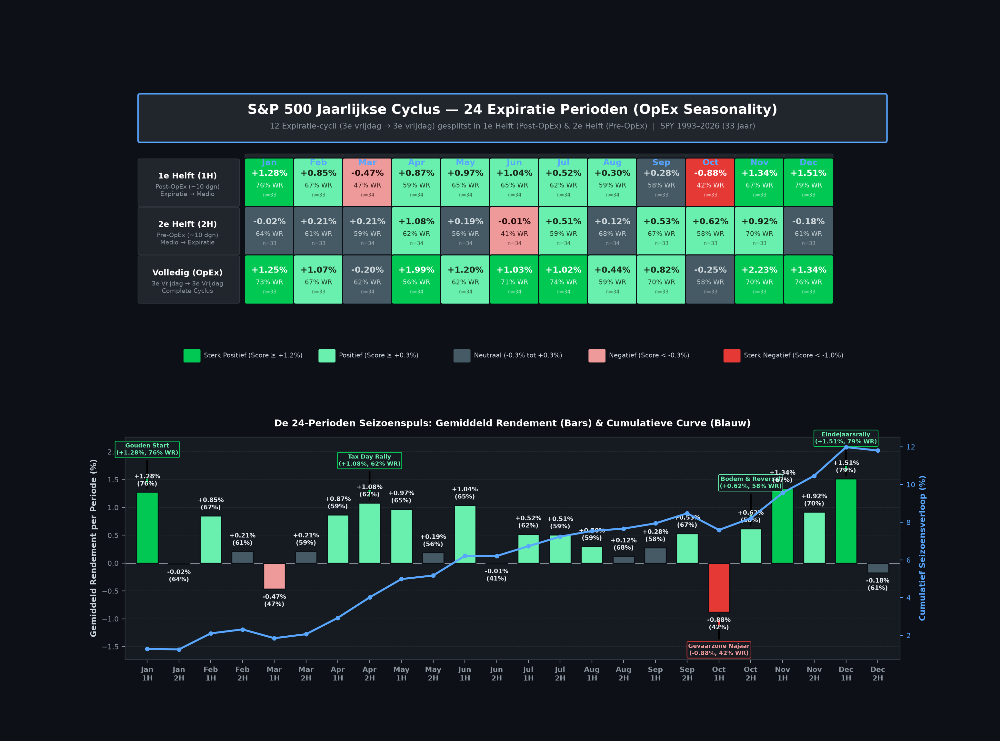

# De Jaarlijkse Cyclus: 24 Expiratie-Perioden & OpEx Seizoenspatronen

*Een empirische analyse van de S&P 500 (SPY 1993 – 2026) over 12 maandelijkse optie-expiraties en 24 seizoenshelften*

---

## 1. Introductie: Waarom 24 Expiratie-Perioden?

Klassieke seizoensanalyses kijken vrijwel altijd naar de **kalendermaand**: van de 1e tot de 30e/31e van de maand. Hoewel dit intuïtief lijkt voor kalendergebruikers, strookt het niet met de werkelijke geldstromen op Wall Street.

De institutionele geldstroom, derivatenposities, optie-rollovers en dealer gamma-afwikkeling zijn namelijk geankerd aan de **maandelijkse optie-expiratie (OpEx)**: de **3e vrijdag van elke maand**.

In dit diepgaande kwantitatieve onderzoek splitsen we het beursjaar op in **12 aaneengesloten OpEx-cycli** (van 3e vrijdag tot 3e vrijdag), en knippen we elke cyclus exact in twee gelijke helften van circa 10 handelsdagen:
1. **1e Helft (1H: Post-OpEx & Maandstart)**: Van de 3e vrijdag van de voorgaande maand tot halverwege de cyclus (dag 1 t/m ~10).
2. **2e Helft (2H: Pre-OpEx & Expiratierun)**: Van halverwege de cyclus tot aan de nieuwe 3e vrijdag (dag ~11 t/m ~20).

Samen levert dit **24 opeenvolgende perioden** op. Het resultaat is een ongeëvenaard gedetailleerde seizoenspuls van de Amerikaanse aandelenmarkt over 33 jaar aan marktdata (SPY 1993–2026).

---

## 2. De 24-Perioden Seizoenskalender (Infographic)

Onderstaande datavisualisatie toont de volledige seizoensmatrix: de 12 expiratie-maanden horizontaal, met de 1e helft (1H), de 2e helft (2H) en het totale cyclusrendement, inclusief de sequentiële seizoenspuls met de cumulatieve koerscurve.

---

## 3. De Volledige Data: Overzicht per Periode (SPY 1993–2026)

| Expiratie Maand | Periode | Fase / Omschrijving | Gem. Rendement | Mediaan | Win Rate (%) | Karakter / Classificatie |
| :--- | :---: | :--- | :---: | :---: | :---: | :--- |
| **Januari** | **1H** | Post-Dec OpEx & Start Nieuwjaar | **+1.28%** | +1.31% | **76%** | 🟢 **Sterk Positief** (Gouden Start) |
| | **2H** | Pre-Jan OpEx consolidatie | -0.02% | +0.48% | 64% | ⬛ Neutraal |
| | *Totaal* | *Januari Expiratie Cyclus* | *+1.25%* | *+1.64%* | *73%* | 🟢 *Sterk Positief* |
| **Februari** | **1H** | Post-Jan OpEx & Vroege Feb Rally | **+0.85%** | +1.10% | **67%** | 🟩 **Positief** |
| | **2H** | Pre-Feb OpEx | +0.21% | +0.45% | 61% | ⬛ Neutraal |
| | *Totaal* | *Februari Expiratie Cyclus* | *+1.07%* | *+1.66%* | *67%* | 🟩 *Positief* |
| **Maart** | **1H** | Post-Feb OpEx (Lente Dip) | **-0.47%** | -0.12% | **47%** | 🟥 **Negatief** (Q1 Correctie) |
| | **2H** | Pre-Q1 Triple Witching Herstel | +0.21% | +0.33% | 59% | ⬛ Neutraal |
| | *Totaal* | *Maart Expiratie Cyclus* | *-0.20%* | *+0.66%* | *62%* | ⬛ *Neutraal* |
| **April** | **1H** | Post-Maart OpEx & Begin April | **+0.87%** | +0.88% | **59%** | 🟩 **Positief** |
| | **2H** | Tax-Day Run-up naar April OpEx | **+1.08%** | +1.03% | **62%** | 🟢 **Sterk Positief** |
| | *Totaal* | *April Expiratie Cyclus* | *+1.99%* | *+1.79%* | *56%* | 🟢 *Sterk Positief* |
| **Mei** | **1H** | Post-Apr OpEx & Start Mei | **+0.97%** | +1.12% | **65%** | 🟩 **Positief** (Mei-start mythe ontkracht) |
| | **2H** | Pre-Mei OpEx | +0.19% | +0.24% | 56% | ⬛ Neutraal |
| | *Totaal* | *Mei Expiratie Cyclus* | *+1.20%* | *+1.41%* | *62%* | 🟩 *Positief* |
| **Juni** | **1H** | Post-Mei OpEx & Vroege Juni | **+1.04%** | +0.89% | **65%** | 🟩 **Positief** |
| | **2H** | Pre-Q2 Triple Witching Dip | **-0.01%** | -0.32% | **41%** | 🟥 **Zwak** (Laagste WR van de zomer) |
| | *Totaal* | *Juni Expiratie Cyclus* | *+1.03%* | *+1.35%* | *71%* | 🟩 *Positief* |
| **Juli** | **1H** | Post-Juni OpEx & Zomerinstroom | **+0.52%** | +0.76% | **62%** | 🟩 **Positief** |
| | **2H** | Pre-Juli OpEx Earnings Rally | **+0.51%** | +0.95% | **59%** | 🟩 **Positief** |
| | *Totaal* | *Juli Expiratie Cyclus* | *+1.02%* | *+1.48%* | *74%* | 🟩 *Positief* |
| **Augustus** | **1H** | Post-Juli OpEx | +0.30% | +0.55% | 59% | ⬛ Neutraal |
| | **2H** | Pre-Aug OpEx (Zomerluwte) | +0.12% | +0.39% | **68%** | ⬛ Neutraal |
| | *Totaal* | *Augustus Expiratie Cyclus* | *+0.44%* | *+0.73%* | *59%* | ⬛ *Neutraal* |
| **September**| **1H** | Post-Aug OpEx & Labor Day | +0.28% | +0.47% | 58% | ⬛ Neutraal |
| | **2H** | Pre-Q3 Triple Witching Run-up | **+0.53%** | +0.78% | **67%** | 🟩 **Positief** |
| | *Totaal* | *September Expiratie Cyclus* | *+0.82%* | *+0.98%* | *70%* | 🟩 *Positief* |
| **Oktober** | **1H** | **Post-Sep OpEx → Eind Sep / Begin Okt** | **-0.88%** | **-0.78%** | **42%** | 🔴 **Sterk Negatief (De Gevaarzone)** |
| | **2H** | **Pre-Okt OpEx (Bodem & Reversal)** | **+0.62%** | +0.71% | **58%** | 🟩 **Positief (De Grote Ommekeer)** |
| | *Totaal* | *Oktober Expiratie Cyclus* | *-0.25%* | *+0.85%* | *58%* | ⬛ *Neutraal* |
| **November** | **1H** | Post-Okt OpEx & Start November | **+1.34%** | +1.40% | **67%** | 🟢 **Sterk Positief** |
| | **2H** | Pre-Nov OpEx (Pre-Thanksgiving Run) | **+0.92%** | +0.95% | **70%** | 🟢 **Sterk Positief** |
| | *Totaal* | *November Expiratie Cyclus* | *+2.23%* | *+2.15%* | *70%* | 🟢 *Sterk Positief (Beste Cyclus)* |
| **December** | **1H** | Post-Nov OpEx (Thanksgiving → Sinterklaas) | **+1.51%** | +1.63% | **79%** | 🟢 **Sterk Positief (Beste Enkele Periode)** |
| | **2H** | Pre-Q4 Quadruple Witching | -0.18% | +0.22% | 61% | ⬛ Neutraal (Winstneming vóór OpEx) |
| | *Totaal* | *December Expiratie Cyclus* | *+1.34%* | *+1.58%* | *76%* | 🟢 *Sterk Positief* |

---

## 4. De Vijf Belangrijkste Inzichten

### Inzicht 1: De Mythe van "September" ontleed — De echte crash zit in Oktober 1H
Veel beleggers vrezen de hele maand september. De data laat echter een fascinerende nuance zien:
* De **September Expiratiecyclus als geheel** (3e vrijdag aug tot 3e vrijdag sep) is gemiddeld **positief (+0.82%, 70% Win Rate)**. Vooral **September 2H** (de aanloop naar de 3e vrijdag) kent met **+0.53% en 67% winstkans** verrassend veel opwaartse druk door derivaten-afwikkeling.
* **Het echte gevaar begint direct ná de september-expiratie!** 
* **Oktober 1H** (de periode van medio september tot begin oktober) is met afstand de **slechtste periode van het hele beursjaar**:
  * Gemiddeld rendement: **-0.88%**
  * Win Rate: slechts **42%** (minder dan de helft van de jaren eindigt in de plus).
  * Dit is de periode waarin historische correcties en flash crashes (zoals 1929, 1987, 2008) zich concentreren.

### Inzicht 2: De Grote Oktober Reversal vindt plaats in Oktober 2H
Waar Oktober 1H dieprood kleurt, volgt in **Oktober 2H** de spectaculaire ommekeer:
* Het gemiddelde rendement schiet omhoog naar **+0.62%** met een win rate van **58%**.
* De markt zet hier steevast zijn **seizoensmatige herfstbodem** neer in de week vóór of op de 3e vrijdag van oktober. Beleggers die wachten tot november om in te stappen, missen stelselmatig de eerste en meest explosieve fase van de eindejaarsrally.

### Inzicht 3: "Sell in May" klopt niet — De zwakte zit pas in Juni 2H
Het bekende beursgezegde *"Sell in May and go away"* wordt door de data genuanceerd:
* **Mei 1H** is uitgesproken bullish met **+0.97% gemiddeld en 65% winstkans**.
* Ook **Juni 1H** presteert krachtig met **+1.04% (65% WR)**.
* De werkelijke seizoensdip voor de zomer treedt pas op in **Juni 2H** (de aanloop naar de kwartaal-expiratie van juni): met een win rate van slechts **41%** (de laagste winstkans van de hele lente en zomer) en een gemiddeld rendement van **-0.01%**.

### Inzicht 4: De Gouden Q4 Trein (November 1H t/m December 1H)
Van eind oktober tot half december bevindt de S&P 500 zich in zijn krachtigste seizoensmatige opwaartse versnelling:
* **November 1H**: +1.34% (67% WR)
* **November 2H**: +0.92% (70% WR)
* **December 1H**: **+1.51% (79% WR)** — de allerhoogste winstkans en het hoogste gemiddelde rendement van alle 24 perioden!
* Opvallend: in **December 2H** (de week voorafgaand aan de december Quadruple Witching) vlakken de winsten vaak af (-0.18%), omdat institutionele partijen boeken sluiten en winsten veiligstellen.

### Inzicht 5: 1e Helft vs. 2e Helft Karakterverschil
* **1H (Post-OpEx / Maandstart)** is de fase van **directe koerskracht**: gemiddeld rendement over alle 12 maanden is **+0.65%**. Hier spelen institutionele allocaties bij het begin van nieuwe kalendermaanden een grote rol.
* **2H (Pre-OpEx / Expiratierun)** is de fase van **reversals en stabilisatie**: gemiddeld rendement is **+0.36%**, maar fungeert als hefboom voor marktommekeren (zoals in Maart 2H en Oktober 2H).

---

## 5. Praktische Handelsregels voor Beleggers en Optietraders

1. **Credit Put Spreads & Bullish Trades**:
   * **Absolute toptijden**: December 1H (79% WR), Januari 1H (76% WR), November 1H/2H (67-70% WR), April 2H (62% WR).
   * Verkoop puts bij voorkeur direct op of net na de expiratievrijdag in sterke seizoensmaanden.
2. **Defensieve Hedging & Short Delta**:
   * **Gevaarzone 1: Oktober 1H** (Direct na 3e vrijdag september tot begin oktober). Koop protectie (long puts / VIX calls) rond de september OpEx.
   * **Gevaarzone 2: Maart 1H** (Direct na februari OpEx).
   * **Gevaarzone 3: Juni 2H** (Medio juni in de aanloop naar Q2 OpEx).
3. **De "October OpEx Dip-Buy" Regel**:
   * Stap agressief long in de week van **Oktober 2H** (tussen 10 en 18 oktober). De kans op een herstelrally richting November is historisch bijna 70%.

---

*Disclaimer: Deze kwantitatieve analyse is samengesteld voor educatieve en onderzoeksdoeleinden en vormt geen persoonlijk financieel advies. In het verleden behaalde resultaten bieden geen garantie voor de toekomst.*
