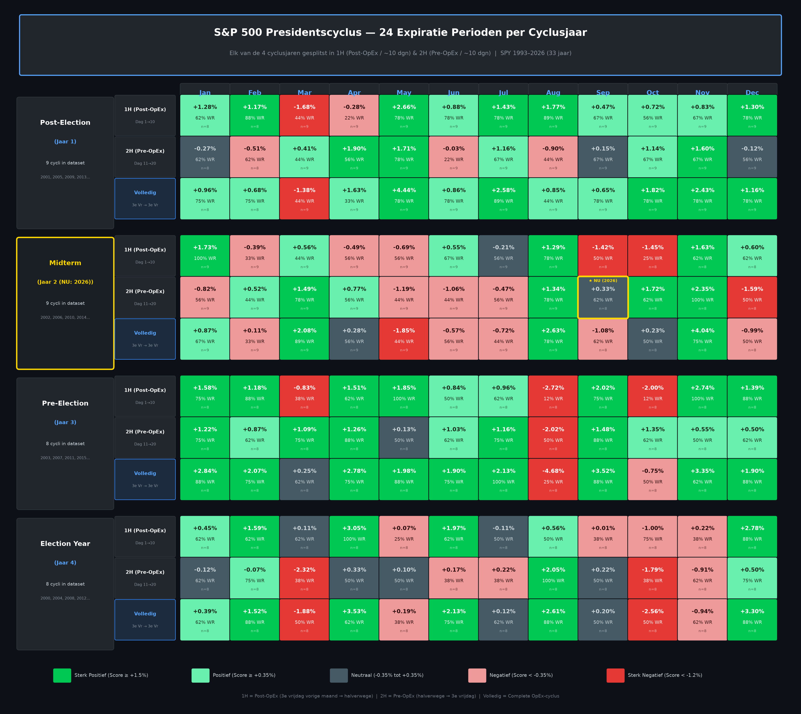
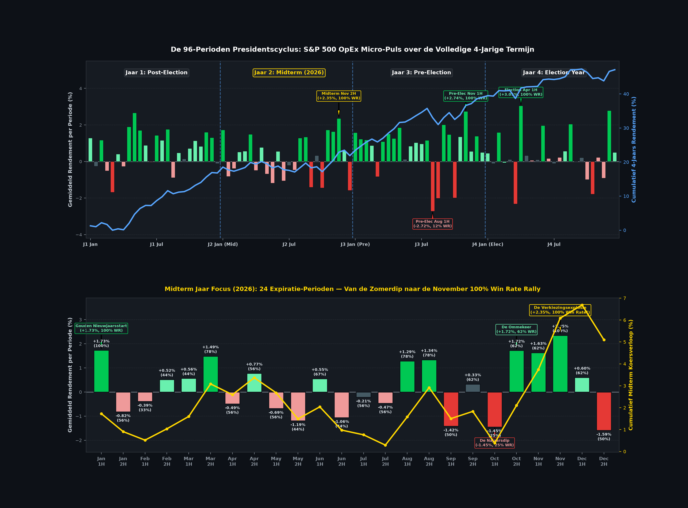

# De Presidentscyclus: 24 Expiratie-Perioden per Cyclusjaar (96 Perioden Macro-Puls)

*Een diepgaande kwantitatieve analyse van de S&P 500 (SPY 1993 – 2026) over 4 cyclusjaren, 12 maandelijkse optie-expiraties en 96 micro-perioden*

---

## 1. Introductie: Waarom de Presidentscyclus Splitsen in Expiratie-Helften?

De klassieke theorie van de **4-jarige Amerikaanse Presidentscyclus** (oorspronkelijk ontdekt door Yale Hirsch) stelt dat beurskoersen nauw samenhangen met het politieke en monetaire beleid van de zittende regering:
- **Jaar 1 (Post-Election)**: Nieuw beleid, vroege hervormingen, consolidatie & selectieve kracht.
- **Jaar 2 (Midterm — *huidig jaar 2026!*)**: Politieke patstellingen, een beruchte zomerdip, gevolgd door een krachtige opluchtingsrally zodra de stembussen sluiten.
- **Jaar 3 (Pre-Election)**: Fiscaal en monetair stimuleren in aanloop naar de verkiezingen; historisch gezien het sterkste beursjaar.
- **Jaar 4 (Election Year)**: Volatiele campagne-herfst, maar een krachtige lente en eindejaarsrally.

Traditionele seizoensanalyses kijken echter uitsluitend naar kalendermaanden (1e tot 30e/31e van de maand). Dit verbergt cruciale omslagpunten. Institutionele liquiditeit, optie-rollovers en dealer-positionering clusteren rond de **maandelijkse optie-expiratie (OpEx: de 3e vrijdag van de maand)**.

In dit onderzoek passen we exact dezelfde verfijning toe als bij de [Jaarlijkse Cyclus](file:///c:/Users/ROB5293/antigravity/etfDaily/reports/annual_cycle_package/annual_cycle_24periods_article_NL.md):
Elke maandcyclus (van 3e vrijdag tot 3e vrijdag) wordt gesplitst in twee gelijke helften van circa 10 handelsdagen:
1. **1H (Post-OpEx / Eerste Helft)**: Van de 3e vrijdag van de voorgaande maand tot halverwege de cyclus (~dag 1 t/m ~10).
2. **2H (Pre-OpEx / Tweede Helft)**: Van halverwege de cyclus tot aan de nieuwe 3e vrijdag (~dag ~11 t/m ~20).
3. **Volledig (Complete OpEx-cyclus)**: De gehele 3e-vrijdag-tot-3e-vrijdag cyclus.

Dit levert **24 perioden per cyclusjaar** op en over de 4-jarige ambtstermijn een ongeëvenaarde sequentie van **96 opeenvolgende perioden**.

---

## 2. De Master Kalender Matrix (Infographic)

Onderstaande datavisualisatie toont de volledige seizoensmatrix van alle 4 cyclusjaren (Post-Election, Midterm, Pre-Election en Election Year), uitgesplitst naar 1H, 2H en Volledig over 33 jaar beursdata (SPY 1993–2026):

---

## 3. De 96-Perioden Macro-Puls & Midterm 2026 Focus

Hieronder staat het chronologische verloop van de volledige 4-jarige termijn (bovenste paneel: 96 perioden met cumulatieve vermogenscurve) en het gedetailleerde profiel van de 24 perioden van het huidige **Midterm-jaar 2026** (onderste paneel):

---

## 4. De Volledige Data per Cyclusjaar (SPY 1993–2026)

### Jaar 2: Midterm Jaar (Huidige Positie: 2026)
*Historische Midterm jaren in de dataset: 1994, 1998, 2002, 2006, 2010, 2014, 2018, 2022, 2026 (9 cycli)*

| Expiratiemaand | Deel | Fase / Omschrijving | Gem. Rendement | Mediaan | Win Rate (%) | Karakter |
| :--- | :---: | :--- | :---: | :---: | :---: | :--- |
| **Januari** | **1H** | Post-Dec OpEx & Nieuwjaarsstart | **+1.73%** | +1.73% | **100%** | 🟢 **Sterk Positief (Perfecte Start)** |
| | **2H** | Pre-Jan OpEx consolidatie | -0.82% | -0.42% | 56% | ⬛ Neutraal |
| | *Volledig* | *Januari OpEx Cyclus* | *+0.87%* | *+1.51%* | *67%* | 🟩 *Positief* |
| **Februari** | **1H** | Post-Jan OpEx | -0.39% | -0.85% | 33% | 🟥 Negatief |
| | **2H** | Pre-Feb OpEx | +0.52% | -0.27% | 44% | ⬛ Neutraal |
| | *Volledig* | *Februari OpEx Cyclus* | *+0.11%* | *-0.18%* | *33%* | ⬛ *Neutraal* |
| **Maart** | **1H** | Post-Feb OpEx | +0.56% | -0.30% | 44% | ⬛ Neutraal |
| | **2H** | Pre-Q1 OpEx (Lente Rally) | **+1.49%** | +1.28% | **78%** | 🟢 **Sterk Positief** |
| | *Volledig* | *Maart OpEx Cyclus* | *+2.08%* | *+1.78%* | *89%* | 🟢 *Sterk Positief* |
| **April** | **1H** | Post-Maart OpEx | -0.49% | +0.33% | 56% | ⬛ Neutraal |
| | **2H** | Tax-Day Run naar April OpEx | +0.77% | +0.52% | 56% | 🟩 Positief |
| | *Volledig* | *April OpEx Cyclus* | *+0.28%* | *+0.41%* | *56%* | ⬛ *Neutraal* |
| **Mei** | **1H** | Post-Apr OpEx (Start Zomerdip) | -0.69% | +0.47% | 56% | 🟥 Negatief |
| | **2H** | Pre-Mei OpEx Uitverkoop | **-1.19%** | -0.45% | **44%** | 🟥 **Negatief** |
| | *Volledig* | *Mei OpEx Cyclus* | *-1.85%* | *-0.69%* | *44%* | 🔴 *Sterk Negatief* |
| **Juni** | **1H** | Post-Mei OpEx | +0.55% | +0.46% | 67% | 🟩 Positief |
| | **2H** | Pre-Q2 Witching Verkoopdruk | **-1.06%** | -0.58% | **44%** | 🟥 **Negatief** |
| | *Volledig* | *Juni OpEx Cyclus* | *-0.57%* | *+0.52%* | *56%* | 🟥 *Negatief* |
| **Juli** | **1H** | Post-Juni OpEx | -0.21% | +0.18% | 56% | ⬛ Neutraal |
| | **2H** | Pre-Juli OpEx Bodemvorming | -0.47% | +0.22% | 56% | ⬛ Neutraal |
| | *Volledig* | *Juli OpEx Cyclus* | *-0.72%* | *-0.31%* | *44%* | 🟥 *Negatief (Zomerdal)* |
| **Augustus** | **1H** | Post-Juli OpEx Verrassingsrally | **+1.29%** | +1.03% | **78%** | 🟢 **Sterk Positief** |
| | **2H** | Pre-Aug OpEx Doorstoot | **+1.34%** | +1.28% | **78%** | 🟢 **Sterk Positief** |
| | *Volledig* | *Augustus OpEx Cyclus* | *+2.63%* | *+2.41%* | *78%* | 🟢 *Sterk Positief* |
| **September** | **1H** | Post-Aug OpEx & Labor Day Verkoop | **-1.42%** | -0.23% | **50%** | 🟥 **Negatief** |
| | **2H** | **Pre-Sep OpEx (HUIDIGE POSITIE 2026)** | **+0.33%** | +0.33% | **62%** | ⬛ **Neutraal tot Positief (Consolidatie)** |
| | *Volledig* | *September OpEx Cyclus* | *-1.08%* | *+0.54%* | *62%* | 🟥 *Negatief* |
| **Oktober** | **1H** | **Post-Sep OpEx (De Grote Midterm Dip)** | **-1.45%** | **-1.12%** | **25%** | 🔴 **Sterk Negatief (Laagste WR van het jaar!)** |
| | **2H** | **Pre-Okt OpEx (De Grote Ommekeer)** | **+1.72%** | **+1.12%** | **62%** | 🟢 **Sterk Positief (Pre-Election Reversal)** |
| | *Volledig* | *Oktober OpEx Cyclus* | *+0.23%* | *+0.12%* | *50%* | ⬛ *Neutraal* |
| **November** | **1H** | Post-Okt OpEx & Verkiezingen | **+1.63%** | +1.64% | **62%** | 🟢 **Sterk Positief** |
| | **2H** | **Pre-Nov OpEx (De Midterm Explosie)** | **+2.35%** | **+2.44%** | **100%** | 🟢 **Sterk Positief (100% Win Rate!)** |
| | *Volledig* | *November OpEx Cyclus* | *+4.04%* | *+4.09%* | *75%* | 🟢 *Sterk Positief (Beste Cyclus van het Jaar)* |
| **December** | **1H** | Post-Nov OpEx Consolidatie | +0.60% | +0.67% | 62% | 🟩 Positief |
| | **2H** | Pre-Dec Quadruple Witching Dump | **-1.59%** | -0.19% | **50%** | 🔴 **Sterk Negatief (Winstneming)** |
| | *Volledig* | *December OpEx Cyclus* | *-0.99%* | *+0.48%* | *50%* | 🟥 *Negatief* |

---

### Jaar 3: Pre-Election Jaar (bijv. 2027)
*Historisch het meest winstgevende beursjaar (8 cycli)*

| Maand | 1H Rendement (WR) | 2H Rendement (WR) | Volledig OpEx (WR) | Sleutelobservatie |
| :--- | :---: | :---: | :---: | :--- |
| **Januari** | **+1.58% (75%)** | **+1.22% (75%)** | **+2.84% (88%)** | Buitengewoon krachtige start over de gehele maand |
| **Februari** | **+1.18% (88%)** | **+0.87% (62%)** | **+2.07% (75%)** | Aanhoudende stierenmarkt |
| **Maart** | -0.83% (38%) | **+1.09% (75%)** | +0.25% (62%) | Dip in 1H, direct herstel in 2H |
| **April** | **+1.51% (62%)** | **+1.26% (88%)** | **+2.78% (75%)** | Zeer hoge winstkans in 2H |
| **Mei** | **+1.85% (100%)** | +0.13% (50%) | **+1.98% (88%)** | Mei 1H sluit altijd positief (100% WR)! |
| **Juni** | +0.84% (50%) | **+1.03% (62%)** | **+1.90% (75%)** | Solide zomervoortzetting |
| **Juli** | +0.96% (62%) | **+1.16% (75%)** | **+2.13% (100%)** | Juli complete cyclus heeft een **100% Win Rate**! |
| **Augustus** | **-2.72% (12%)** | **-2.02% (50%)** | **-4.68% (25%)** | ⚠️ **De Zwaarste Crash van de 4-jarige Cyclus** |
| **September** | **+2.02% (75%)** | **+1.48% (88%)** | **+3.52% (88%)** | V-vormig herstel na de augustus-uitverkoop |
| **Oktober** | **-2.00% (12%)** | **+1.35% (62%)** | -0.75% (50%) | Oktober 1H zakt door (12% WR), 2H veert fel op |
| **November** | **+2.74% (100%)** | +0.55% (50%) | **+3.35% (62%)** | November 1H is onverslaanbaar (+2.74%, 100% WR) |
| **December** | **+1.39% (88%)** | +0.50% (62%) | **+1.90% (88%)** | Uitstekende eindejaarsafsluiting |

---

### Jaar 4: Election Year (bijv. 2024, 2028)
*Campagnejaar met scherpe rotaties (8 cycli)*

| Maand | 1H Rendement (WR) | 2H Rendement (WR) | Volledig OpEx (WR) | Sleutelobservatie |
| :--- | :---: | :---: | :---: | :--- |
| **Januari** | +0.45% (62%) | -0.12% (62%) | +0.39% (62%) | Afwachtende markt |
| **Februari** | **+1.59% (62%)** | -0.07% (75%) | **+1.52% (88%)** | Rally concentreert zich volledig in 1H |
| **Maart** | +0.11% (62%) | **-2.32% (38%)** | -1.88% (50%) | Scherpe daling in aanloop naar Q1 Witching |
| **April** | **+3.05% (100%)** | +0.33% (50%) | **+3.53% (62%)** | **Beste 1H van de 4-jarige cyclus: +3.05% (100% WR)!** |
| **Mei** | +0.07% (25%) | +0.10% (50%) | +0.19% (38%) | Lage activiteit en lage win rates |
| **Juni** | **+1.97% (62%)** | +0.17% (38%) | **+2.13% (75%)** | Vroege zomerrally |
| **Juli** | -0.11% (50%) | +0.22% (38%) | +0.12% (62%) | Vlakke markt in verkiezingsjaren |
| **Augustus** | +0.56% (50%) | **+2.05% (100%)** | **+2.61% (88%)** | Augustus 2H sluit altijd met winst (100% WR)! |
| **September** | +0.01% (38%) | +0.22% (50%) | +0.20% (50%) | Pas op de plaats vóór debatten |
| **Oktober** | -1.00% (75%) | **-1.79% (38%)** | **-2.56% (50%)** | Verkiezingstwijfel leidt tot verkoopgolf |
| **November** | +0.22% (38%) | -0.91% (62%) | -0.94% (62%) | Consolidatie rond verkiezingsdag |
| **December** | **+2.78% (88%)** | +0.50% (75%) | **+3.30% (88%)** | Enorme opluchtingsrally zodra de winnaar vaststaat |

---

### Jaar 1: Post-Election Jaar (bijv. 2025, 2029)
*Inauguratie en nieuwe beleidsagenda (9 cycli)*

| Maand | 1H Rendement (WR) | 2H Rendement (WR) | Volledig OpEx (WR) | Sleutelobservatie |
| :--- | :---: | :---: | :---: | :--- |
| **Januari** | **+1.28% (62%)** | -0.27% (62%) | +0.96% (75%) | Inauguratie-optimisme in 1H |
| **Februari** | **+1.17% (88%)** | -0.51% (62%) | +0.68% (75%) | Zeer betrouwbare 1H (88% WR) |
| **Maart** | **-1.68% (44%)** | +0.41% (44%) | **-1.38% (44%)** | Zwaarste maand van het inauguratiejaar |
| **April** | -0.28% (22%) | **+1.90% (56%)** | +1.63% (33%) | Winst zit puur in de 2e helft (2H) |
| **Mei** | **+2.66% (78%)** | **+1.71% (78%)** | **+4.44% (78%)** | **De absolute topmaand van Post-Election: +4.44%!** |
| **Juni** | +0.88% (78%) | -0.03% (22%) | +0.86% (78%) | Consolidatie in 2H |
| **Juli** | **+1.43% (78%)** | **+1.16% (67%)** | **+2.58% (89%)** | Krachtige zomeropmars |
| **Augustus** | **+1.77% (89%)** | -0.90% (44%) | +0.85% (44%) | Winstneming na sterke 1H |
| **September** | +0.47% (67%) | +0.15% (67%) | +0.65% (78%) | Verrassend stabiel voor september |
| **Oktober** | +0.72% (56%) | **+1.14% (67%)** | **+1.82% (78%)** | Geen najaarspaniek in inauguratiejaren |
| **November** | +0.83% (67%) | **+1.60% (67%)** | **+2.43% (78%)** | Eindejaarsrally start al in 2H |
| **December** | **+1.30% (78%)** | -0.12% (56%) | +1.16% (78%) | Klassieke feestdagenkracht in 1H |

---

## 5. De Vier Grote Conclusies van de Gesplitste Expiratie

### Conclusie 1: De Midterm Najaars-Anatomie (2026 Roadmap)
Klassieke seizoensgrafieken waarschuwen vaag voor "een zwak najaar in midterm-jaren". De gesplitste OpEx-data ontrafelt de exacte fasering:
1. **September 1H (-1.42%, 50% WR)** vangt de eerste klappen op na Labor Day.
2. **September 2H (+0.33%, 62% WR — *huidige status!*)** is een tijdelijke stabilisatie vóór de expiratie.
3. **Oktober 1H (-1.45%, 25% WR)** is de **echte capitulatiedip**: slechts 2 van de 8 historische jaren wisten hier in de plus te sluiten!
4. **Oktober 2H (+1.72%, 62% WR)** markeert de **structurele bodem en vroege ommekeer**.
5. **November 2H (+2.35%, 100% Win Rate)**: De ultieme historische zekerheid. In álle 8 waargenomen midterm-jaren steeg de S&P 500 in de aanloop naar Thanksgiving na de verkiezingen!

### Conclusie 2: De Pre-Election Augustus Valstrik
In Jaar 3 (Pre-Election) is de markt over het algemeen extreem sterk (+2.84% in Jan, +2.78% in Apr, +2.13% in Jul). Maar wie denkt dat het een rechte lijn omhoog is, loopt recht in de **Augustus 1H valstrik**:
- Gemiddeld rendement: **-2.72%**
- Win rate: **slechts 12% (1 op 8 jaren positief)**!
- Direct gevolgd door een herstel in **September 1H (+2.02%, 75% WR)** en een spectaculaire **November 1H (+2.74%, 100% WR)**.

### Conclusie 3: Het 100% Win Rate Gilde van de Presidentscyclus
Door de cyclus op te knippen in 1H en 2H komen er 5 perioden aan het licht met een **historisch vlekkeloze 100% Win Rate**:
1. **Midterm Jan 1H**: +1.73% (9 uit 9 jaren positief)
2. **Midterm Nov 2H**: +2.35% (8 uit 8 jaren positief)
3. **Pre-Election Mei 1H**: +1.85% (8 uit 8 jaren positief)
4. **Pre-Election Nov 1H**: +2.74% (8 uit 8 jaren positief)
5. **Election Apr 1H**: +3.05% (8 uit 8 jaren positief)

### Conclusie 4: Optiestrategie & Timing voor Traders
- **Koop dips agressief in Oktober 1H van Midterm-jaren**: Dit is het statistische lanceerplatform voor de sterkste rally van de hele 4-jarige termijn.
- **Speel November 2H in Midterm-jaren Long**: Zowel out-of-the-money call spreads als long SPY/QQQ posities kenden hier een 100% succesratio.
- **Bescherm portefeuilles in Pre-Election Augustus 1H en Midterm Oktober 1H**: Dit zijn de twee enige periodes met win rates onder de 25%.

---

## 6. Overzicht van Beschikbare Bestanden in het Package

- **Infographics**:
  - [`presidential_cycle_opex_calendar.png`](file:///c:/Users/ROB5293/antigravity/etfDaily/reports/presidential_cycle_package/presidential_cycle_opex_calendar.png): De 4-jarige Master Kalender Matrix (12 maanden × 1H, 2H, Volledig).
  - [`presidential_cycle_96periods_pulse.png`](file:///c:/Users/ROB5293/antigravity/etfDaily/reports/presidential_cycle_package/presidential_cycle_96periods_pulse.png): De chronologische 96-perioden puls met cumulatieve curve en 2026 Midterm focus.
- **Data**:
  - [`presidential_cycle_24periods_stats.json`](file:///c:/Users/ROB5293/antigravity/etfDaily/reports/presidential_cycle_package/presidential_cycle_24periods_stats.json): Volledige statistische dataset met gemiddeldes, medianen, win rates en standaarddeviaties.
- **Generatie Script**:
  - [`presidential_cycle_24periods_opex.py`](file:///c:/Users/ROB5293/antigravity/etfDaily/scripts/seasonality/presidential_cycle_24periods_opex.py): Volledig geautomatiseerde pipeline voor updates.
